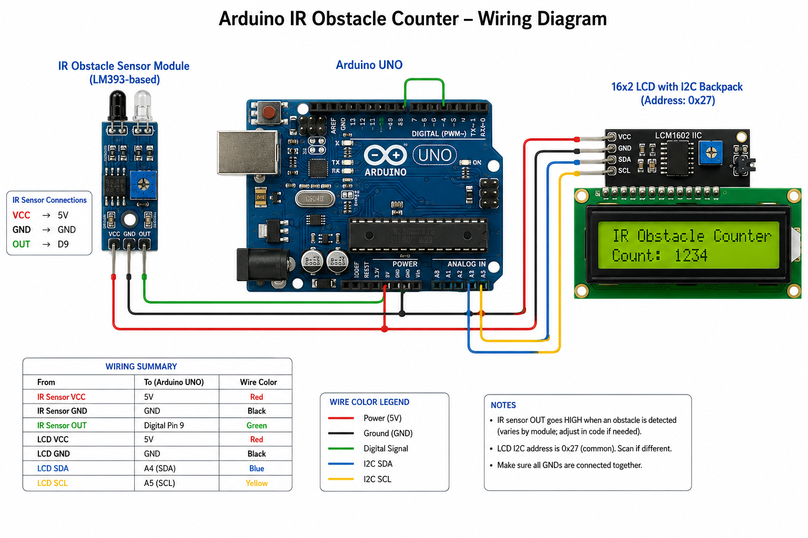

# IR Obstacle Counter using Arduino

A real-time object counting system using an IR obstacle sensor and a 16x2 I2C LCD display. Built during my internship at Vi Microsystems, this project detects object presence via an LM393-based IR sensor and displays a live count on the LCD.

## Demo

## Hardware image

## Hardware Used

- Arduino 
- IR Obstacle Sensor Module (LM393-based)
- 16x2 LCD with I2C backpack (I2C address: 0x27)
- Jumper wires, breadboard

## Circuit Diagram

|   Component   |  Arduino Pin  |
|---------------|---------------|
| IR Sensor OUT | Digital Pin 9 |
| IR Sensor VCC | 5V            |
| IR Sensor GND | GND           |
| LCD SDA       | A4            |
| LCD SCL       | A5            |
| LCD VCC       | 5V            |
| LCD GND       | GND           |

## How It Works

The IR sensor continuously outputs a digital HIGH/LOW signal based on whether an object breaks its detection beam. The Arduino polls this signal each loop cycle and compares it against the previous state. On every state transition, the LCD updates to show either "Detected" or "Not Detected," and the counter increments each time an object is newly detected (HIGH → LOW transition).

## Code

See [`obstacle_counter.ino`](obstacle_counter.ino)

## Known Limitations

- No debounce logic — rapid signal noise at the detection threshold could register multiple counts for a single object pass.
- Count resets on power loss (no EEPROM/persistent storage).
- LCD full-clear on every state change may cause minor flicker at high detection frequency.

## Future Improvements

- Add debounce delay to prevent false increments.
- Store count in EEPROM to persist across resets.
- Add a reset button to zero the counter manually.

## Author

[Jerush](https://github.com/Jerush16) — B.E. ECE, Government College of Engineering, Tirunelveli
